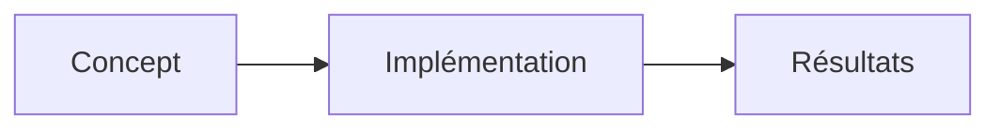

# 🎯 Workflow Manuel — Pipeline Veille Hebdomadaire

> **Pour:** Dimitri (ou Claude lors de scheduled task)
> **Fréquence :** Chaque jeudi matin
> **Durée :** ~30-45 minutes
> **Dépendances :** Claude AI, Markdown editor, Git

---

## ⚙️ Processus Hebdomadaire (Étapes Détaillées)

### 📋 ÉTAPE 1 : Vérifier les URLs Existantes (5 min)

**Objectif :** Charger la liste de toutes les URLs déjà utilisées pour éviter les doublons.

**Action :**
1. Ouvrir le fichier : `logs/URL-REGISTRY.md`
2. **Lire et mémoriser** toutes les URLs listées
3. Copier mentalement la liste pour vérification

**Sortie attendue :**
```
✅ Liste d'URLs chargée en mémoire
✅ Dernière semaine: 2026-03-27 (8 articles)
```

---

### 🔍 ÉTAPE 2 : Rechercher 1 Article par Catégorie (20 min)

**Objectif :** Trouver UN article pertinent par catégorie parmi 8.

**Process pour chaque catégorie :**

#### **Category: Frontend**

```
Chercher: "React Vue Svelte 2026 performance"
Sites: css-tricks.com, dev.to, web.dev, javascript.weekly.com

Critères de sélection:
  ✅ Publié dans les 7 derniers jours (depuis 2026-03-20)
  ✅ Sans paywall
  ✅ Sans "sponsored" ou "promoted"
  ✅ Directement lié aux intérêts (React, Vue, CSS, Performance)
  ⚠️ VÉRIFIER : L'URL n'existe PAS dans URL-REGISTRY.md

Article sélectionné:
  Titre: [À chercher]
  URL: [À vérifier dans registre]
  Source: [À noter]
  Publication: [Date]
```

#### **Category: Backend**

```
Chercher: "Python Node.js APIs 2026"
Sites: nodejs.org/blog, dev.to, dzone.com, news.ycombinator.com

Mêmes critères + VÉRIFIER dans registre
```

#### **Category: DevOps**

```
Chercher: "Docker Kubernetes CI/CD 2026"
Sites: docker.com/blog, kubernetes.io/blog, dev.to, thenewstack.io

Mêmes critères + VÉRIFIER dans registre
```

#### **Category: Sys-Admin**

```
Chercher: "Linux Networking Security 2026"
Sites: linuxjournal.com, archlinux.org, dev.to, ubuntu.com/blog

Mêmes critères + VÉRIFIER dans registre
```

#### **Category: Database**

```
Chercher: "PostgreSQL MongoDB SQL 2026"
Sites: postgresql.org/news, mongodb.com/blog, dev.to, redis.com/blog

Mêmes critères + VÉRIFIER dans registre
```

#### **Category: Animation-CSS**

```
Chercher: "CSS Animations Transitions 2026"
Sites: codepen.io, css-tricks.com, dev.to

Mêmes critères + VÉRIFIER dans registre
```

#### **Category: Animation-3D**

```
Chercher: "Three.js WebGL Babylon.js 2026"
Sites: threejs.org, babylonjs-playground.com, dev.to, webglacademy.com

Mêmes critères + VÉRIFIER dans registre
```

#### **Category: Strat-Mobile**

```
Chercher: "React Native Flutter PWA 2026"
Sites: reactnative.dev/blog, flutter.dev/blog, mobiledevweekly.com, dev.to

Mêmes critères + VÉRIFIER dans registre
```

**Sortie attendue :**
```
✅ 8 articles trouvés (1 par catégorie)
✅ Aucun doublon (toutes URLs vérifiées dans registre)
✅ Tous pertinents et récents
```

---

### ✍️ ÉTAPE 3 : Créer les 8 Articles Markdown (15 min)

**Objectif :** Générer les fichiers markdown avec frontmatter YAML et contenu français.

**Pour chaque article :**

1. **Créer le frontmatter :**

```yaml
---
title: "Titre Exact de l'Article"
description: "Résumé court en français (max 60 chars)"
date: "YYYY-MM-DD"
published: true
category: "frontend"
tags: ["tag1", "tag2", "tag3"]
level: "intermediate"
readTime: 5
complexity: "medium"
source:
  title: "Titre Original"
  author: "Auteur si connu"
  url: "https://URL-EXACT"
  website: "domaine.com"
  published: "YYYY-MM-DD"
featured: false
newsletter_section: "trends|tools|how-tos|deep-dives"
relevance: "high"
hasCodeExample: true|false  # Selon contenu
hasMermaidDiagram: true|false  # Selon contenu
relatedTopics: []
---
```

2. **Créer le corps en français :**

```markdown
## 🎯 TL;DR
[1-2 phrases résumant l'idée essentielle en français]

## 📖 Contexte & Pertinence
[2-3 paragraphes en français expliquant le sujet]
- Point 1 d'importance
- Point 2 d'importance
- Point 3 d'importance

## 🔑 Points Clés
### Point 1: [Titre]
[Explication détaillée]

### Point 2: [Titre]
[Explication détaillée]

### Point 3: [Titre]
[Explication détaillée]

## 💻 Exemple de Code (SI PERTINENT)
```language
// Code extrait ou inspiré de l'article
```
Explications du code...

## 📊 Diagramme (SI PERTINENT)


## 🛠️ Outils & Technologies Mentionnées
- **[Outil 1]** — Contexte d'utilisation
- **[Outil 2]** — Contexte d'utilisation
- **[Outil 3]** — Contexte d'utilisation

## 👥 Pour Qui ?
[Description profil lecteur cible]

## 🔗 Ressources & Lectures Complémentaires
- [Titre lien](https://URL)
- [Titre lien 2](https://URL2)
```

3. **Sauvegarder le fichier :**
```
content/[category]/YYYY-MM-DD-kebab-case-title.md
```

Exemple:
```
content/frontend/2026-03-27-react-vs-vue-performance-2026.md
```

**Sortie attendue :**
```
✅ 8 fichiers markdown créés
✅ Tous en français
✅ YAML valide
✅ Structure cohérente
```

---

### 📝 ÉTAPE 4 : Mettre à Jour le Registre d'URLs (5 min)

**Objectif :** Tracer les 8 articles créés pour antiduplicatas futur.

**Action :**

Éditer `logs/URL-REGISTRY.md` :

1. **Créer une nouvelle section :**

```markdown
## 📅 Semaine YYYY-MM-DD (8 articles)

### Frontend (1 article)
- **URL :** https://...
- **Titre :** Titre exact
- **Date création :** YYYY-MM-DD
- **Fichier créé :** content/frontend/YYYY-MM-DD-kebab.md
- **Statut :** ✅ Créé
- **Remarques :** Contexte bref

[... répéter pour les 7 autres catégories ...]
```

2. **Mettre à jour les stats :**

```markdown
## 📊 Statistiques

| Métrique | Valeur |
|----------|--------|
| **Total URLs créées** | 24 |
| **Semaines couvertes** | 2 |
| **Articles par semaine** | 8 |
| **Catégories complètes** | 8/8 |
```

**Sortie attendue :**
```
✅ Registre d'URLs mis à jour
✅ 8 nouvelles entrées
✅ Historique complet conservé
```

---

### 🔐 ÉTAPE 5 : Valider et Committer (5 min)

**Objectif :** Assurer cohérence et versionner.

**Validations :**

```
☐ 8 fichiers créés dans content/*/
☐ Aucun fichier ne manque
☐ YAML valide (pas d'erreurs syntaxe)
☐ Contenu 100% français
☐ URLs vérifiées (pas de doublons)
☐ Registre d'URLs mis à jour
☐ Nommage cohérent (YYYY-MM-DD-kebab)
```

**Commit Git :**

```bash
git add content/*/2026-04-03-*.md logs/URL-REGISTRY.md
git commit -m "feat(veille): 8 articles semaine 2026-04-03

- Frontend: [Titre article]
- Backend: [Titre article]
- DevOps: [Titre article]
- Sys-Admin: [Titre article]
- Database: [Titre article]
- Animation-CSS: [Titre article]
- Animation-3D: [Titre article]
- Strat-Mobile: [Titre article]

Antiduplicatas: 0 doublon détecté"
```

**Sortie attendue :**
```
✅ Git commit réussi
✅ Changements versionés
✅ Historique conservé
```

---

## ✅ Checklist Complète

### Avant de Commencer
- [ ] Lire `logs/URL-REGISTRY.md` (charger liste d'URLs)
- [ ] Vérifier calendrier (jeudi matin)
- [ ] Avoir accès à Claude AI et éditeur markdown

### Recherche (Étape 2)
- [ ] Frontend : 1 article trouvé ✓
- [ ] Backend : 1 article trouvé ✓
- [ ] DevOps : 1 article trouvé ✓
- [ ] Sys-Admin : 1 article trouvé ✓
- [ ] Database : 1 article trouvé ✓
- [ ] Animation-CSS : 1 article trouvé ✓
- [ ] Animation-3D : 1 article trouvé ✓
- [ ] Strat-Mobile : 1 article trouvé ✓
- [ ] Aucun doublon (vérifié dans registre)

### Création (Étape 3)
- [ ] Frontmatter YAML valide pour les 8 articles
- [ ] Corps en français 100%
- [ ] Code/diagrammes si pertinent
- [ ] 8 fichiers markdown créés
- [ ] Nommage cohérent

### Mise à Jour Registre (Étape 4)
- [ ] Section semaine créée
- [ ] 8 entrées complètes
- [ ] Stats mises à jour
- [ ] Historique préservé

### Validation Finale (Étape 5)
- [ ] Tous les fichiers présents
- [ ] Pas d'erreurs syntaxe
- [ ] Git commit réussi
- [ ] Changements versionés

---

## ⏰ Exemple Timing

```
Jeudi 09:00
  ├─ 09:00-09:05 : Lire URL-REGISTRY.md (Étape 1)
  ├─ 09:05-09:25 : Rechercher 8 articles (Étape 2)
  ├─ 09:25-09:40 : Créer 8 fichiers markdown (Étape 3)
  ├─ 09:40-09:45 : Mettre à jour registre (Étape 4)
  └─ 09:45-09:50 : Valider et committer (Étape 5)

Total: 50 minutes ✓
```

---

## 🆘 Troubleshooting

### Problème : URL trouvée dans le registre
**Solution :** Rejeter cet article, chercher un autre

### Problème : Article trop vieux (> 7 jours)
**Solution :** Considérer mais noter dans remarques "article ancien"

### Problème : Plusieurs articles bons pour une catégorie
**Solution :** Prendre le plus pertinent et récent

### Problème : Pas d'article trouvé pour une catégorie
**Solution :** Laisser catégorie vide cette semaine (noter dans registre)

### Problème : YAML invalide
**Solution :** Vérifier guillemets, tirets, indentation

---

## 📊 Statistiques Tracking

Après chaque exécution, noter :

```
Semaine du YYYY-MM-DD:
  Articles trouvés: 8/8 ✓
  Doublons évités: 0 ✓
  Contenu français: 100% ✓
  Temps total: 50 min
  Git commits: 1
```

---

## 🔗 Documents Référence

- 📄 `logs/URL-REGISTRY.md` — Registre d'URLs à consulter
- 📄 `newsletter-weekly-pipeline-v2.md` — Spécifications
- 📄 `README-PIPELINE-V2.md` — Guide détaillé
- 📄 `SOLUTION-SUMMARY.md` — Vue d'ensemble

---

**Version :** 1.0
**Créé :** 2026-03-27
**Maintenance :** Hebdomadaire (chaque jeudi)
**Prochain run :** 2026-04-03
