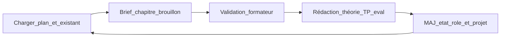
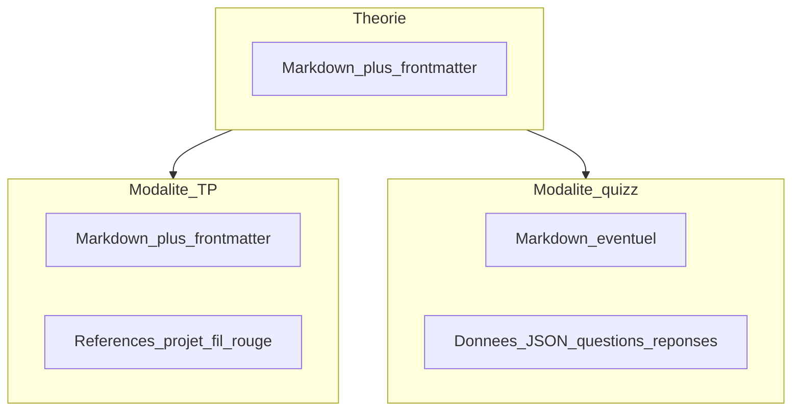

# Mode opératoire — Création de trame par parcours

**Document procédural** — À appliquer pour chaque parcours, chaque rôle et chaque chapitre. Il est **révisable** : après un parcours ou un rôle clos, mettre à jour ce fichier si le retour d’expérience le justifie.

**Référence métier :** le cadrage fonctionnel et pédagogique reste défini dans [expression-besoin.md](./expression-besoin.md) (hiérarchie Rôle → Chapitre, combo théorie / modalités / évaluation / correction, **projet fil rouge** par rôle avec bases intermédiaires).

---

## 1. Objet et périmètre

Ce mode opératoire décrit **comment** produire et enchaîner les supports de formation de manière **itérative** : on part du **plan général** et de **ce qui est déjà livré**, on avance **chapitre par chapitre** (unité théorie + pratique + évaluation), et **aucune rédaction définitive** ne commence avant **validation du brief** par le formateur.

**Périmètre :** processus de création de contenu, **structure des fichiers** sous Nuxt Content, **maillage** entre documents, **données embarquées** par modalité pédagogique (v1 : TP et quizz avec JSON pour le quizz). **Hors périmètre :** implémentation des composants Vue, schéma JSON définitif figé pour toute la durée de vie du produit (voir section 10).

---

## 2. Principes

| Principe | Description |
|----------|-------------|
| **Un rôle à la fois** | On ne mélange pas l’élaboration détaillée de plusieurs rôles dans la même session de travail sans cadrage explicite. |
| **Partir de l’existant** | Chaque cycle commence par la relecture du **référentiel**, des **chapitres déjà livrés** et de l’**état du projet fil rouge** (entrée du chapitre courant). |
| **Chapitre = unité de validation** | Un « combo » chapitre = théorie (éventuellement découpée en **Parties**) + modalités pratiques retenues + évaluation ; le **brief** couvre l’ensemble avant rédaction. |
| **Parties = grain fin** | Sous `content/formations/<role>/<chapitre>/parties/<slug>/`, chaque **Partie** vise une théorie **d’environ 20 minutes max** pour alterner théorie et pratique ; quiz et bloc `modalites.md` sont au niveau de la Partie lorsque le chapitre est découpé ainsi. Les **modalités** (TP, projet) sont des fichiers feuilles sous la Partie concernée. |
| **Validation avant rédaction** | Le formateur valide le **brief chapitre** ; seulement ensuite : rédaction des fichiers de contenu. |
| **Pensé pour Nuxt Content** | Tout livrable doit être adressable en fichiers sous `content/` (ou équivalent), avec **liens navigables** entre documents et **données exploitables** par l’application (frontmatter, Markdown, JSON selon modalité). |

---

## 3. Artefacts de référence

Les noms ci-dessous sont des suggestions ; l’important est d’avoir **au moins** ces fonctions documentées quelque part dans le dépôt (souvent sous `conception/`).

| Artefact | Fonction |
|----------|----------|
| **Plan de formation / référentiel de parcours** | Vision globale, liste des rôles, ordre ou dépendances entre rôles. |
| **Fiche ou section « rôle »** | Identifiant stable (slug), objectifs du rôle, lien vers le dépôt du **projet fil rouge**. |
| **Cartographie des chapitres** | Liste ordonnée des chapitres du rôle, objectifs en une ligne par chapitre. |
| **Journal d’avancement** | Chapitres **livré** vs **à faire**, chemins vers les contenus publiés ou branches, **sortie projet** après dernier chapitre livré. |

Ces artefacts peuvent être un seul fichier Markdown ou plusieurs ; aucun outil imposé.

---

## 4. Entrées et sorties du processus

### 4.1 Entrée (démarrage d’un cycle — typiquement un nouveau chapitre dans un rôle)

| Élément | Rôle |
|---------|------|
| **Référentiel de parcours** | Le plan général : vision, rôles nommés, ordre ou dépendances entre rôles. |
| **Cible courante** | Le **rôle** travaillé + identifiant stable (slug / nom). |
| **Cartographie des chapitres** | Liste des chapitres prévus pour ce rôle (titres, ordre, objectifs brefs). |
| **État d’avancement** | Chapitres **déjà livrés** (lien ou chemin vers les supports) et chapitres **restants**. |
| **Projet fil rouge** | État technique à l’**entrée du chapitre N** : branche, tag, commit, archive — selon votre pratique ([expression du besoin](./expression-besoin.md), section projet support). |
| **Contraintes du tour** | Public, durée, modalités à privilégier ou exclure pour ce chapitre, si pertinent. |

### 4.2 Sortie (fin de cycle pour **un chapitre** validé)

| Élément | Rôle |
|---------|------|
| **Brief chapitre validé** | Synthèse approuvée par le formateur : objectifs pédagogiques, sommaire théorie (éventuellement **découpage en Parties** et durée indicative par Partie), **modalités retenues (TP, quizz, …)** avec **données nécessaires** par modalité, format d’évaluation auto- ou semi-corrigeable, critères de réussite, **plan de liens Nuxt Content** (fichiers cibles et relations). |
| **Plan de rédaction** | Ordre des sous-livrables : théorie (par Partie si découpé) → consignes TP → **données quizz (JSON)** si applicable → évaluation ; **chemins et références** entre fichiers. |
| **État projet après chapitre** | **Sortie technique** du chapitre : où doit en être le projet support pour le chapitre suivant (base à l’entrée de N+1). |
| **Mise à jour du référentiel** | Chapitre passé en **livré** ; **prochaine entrée** (prochain chapitre ou fin de rôle) documentée. |

### 4.3 Entrée / sortie « macro » (optionnel)

- **Entrée d’un nouveau parcours :** plan général + périmètre des rôles v1.
- **Sortie :** tous les rôles et chapitres prévus sont **livré** ou **reportés** avec motif.

---

## 5. Mode opératoire pas à pas

| Étape | Intitulé | Actions |
|-------|----------|---------|
| **E0 — Cadrage** | Charger le contexte | Lire le plan général, la **fiche rôle**, la liste des chapitres, le **dernier état livré** et la **base projet actuelle** (entrée du chapitre à traiter). |
| **E1 — Sélection du chapitre** | Choisir l’unité de travail | Par défaut : **chapitre suivant** dans l’ordre de la cartographie. Tout saut ou réordonnancement est **explicite** et consigné. |
| **E2 — Proposition de brief** | Sans rédaction définitive | Proposer : plan de la théorie ; **modalités TP et/ou quizz** ; **structure des données** par modalité (références dépôt et consignes pour le TP ; **schéma prévu pour le JSON quizz**) ; évaluation compatible avec une correction automatisée ou semi-automatisée ; entrée/sortie **projet fil rouge** ; **liste des fichiers Nuxt Content** et **liens entre eux** (maillage). |
| **E3 — Validation formateur** | Point bloquant | Le formateur **valide** ou **renvoie** le brief. Aucune rédaction longue des contenus finaux avant cette validation. |
| **E4 — Rédaction** | Après E3 uniquement | Ordre recommandé : **théorie** → **contenus TP** → **contenus quizz** (avec **JSON** selon convention) → **évaluation**. Contrôler le **maillage** (liens entre documents, cohérence des chemins, navigation selon les pratiques du repo : `queryContent`, `_path`, etc.). |
| **E5 — Mise à jour de l’état du rôle** | Clôturer le cycle | Marquer le chapitre comme **livré** ; documenter la **sortie projet** pour E0 du chapitre suivant ; mettre à jour le journal d’avancement. |

---

## 6. Rôle de l’assistant ou de l’exécutant

- **S’appuyer** sur le plan général, la cartographie des chapitres et les contenus **déjà produits** pour proposer le brief (E2).
- **Ne pas inventer** de chapitre ou de périmètre hors plan sans **accord explicite** du formateur.
- **Signaler** les écarts : base code manquante, évaluation difficilement auto-corrigeable, trous dans le maillage Nuxt Content.
- À l’étape **E4**, **vérifier** la **cohérence des liens** entre documents et la **validité minimale** du **JSON quizz** (présence des champs attendus par la convention du projet — voir annexe A).

---

## 7. Amélioration continue

Après chaque **parcours** ou **rôle** clos, une courte **rétrospective** peut mettre à jour ce mode opératoire : nouvelles modalités, leçons sur le maillage Content, ajustement du canon JSON quizz, clarification des artefacts. L’objectif est que la trame **reste réaliste** par rapport à l’outil et au temps disponible.

---

## 8. Contraintes Nuxt Content et contenu structuré

### 8.1 Maillage entre contenus

Un **chapitre** correspond à un **ensemble de documents** reliés dans `content/` (ou structure équivalente) :

- document(s) de **théorie** ;
- un ou plusieurs documents de **modalités** (TP, quizz, etc.) ;
- document(s) d’**évaluation** si distincts.

**Bonnes pratiques :**

- arborescence lisible par **rôle** puis **chapitre** (ex. `content/formations/<role>/<chapitre>/`) ;
- **slugs** et noms de fichiers stables et prévisibles ;
- liens explicites entre fichiers (chemins relatifs, propriétés de navigation, ou conventions du module `@nuxt/content`) ;
- à la **création** du chapitre, le **brief validé** inclut une **carte des liens** (qui pointe vers qui).

#### 8.1.0 Parties (optionnel mais recommandé pour les longs chapitres)

Pour limiter la fatigue cognitive et alterner théorie / pratique, un chapitre peut être découpé en **Parties** sous `content/formations/<role>/<chapitre>/parties/<part-slug>/` :

- **`index.md` de Partie** : `type: part-theory`, `order`, `role`, `estimatedTheoryMinutes` (viser **≤ 20 minutes** de théorie lues ou équivalent) ;
- **`quiz-validation.json`** et **`modalites.md`** au même niveau que cet index pour enchaîner quiz puis cartes de modalités sur la **même** page applicative ;
- **Modalités** (TP, projet, etc.) : fichiers Markdown **sous la Partie** concernée ; l’**évaluation** de fin de chapitre reste en général à la racine du chapitre (`evaluation.md`).

Les documents `part-theory` ne doivent **pas** apparaître comme entrées de la liste des chapitres du parcours (filtrage des chemins contenant `/parties/` côté application).

#### 8.1.1 Gestion des chapitres parents et enfants

**Frontmatter obligatoire pour exprimer la dépendance :**

```yaml
---
title: "Chapitre 1 — HTML & CSS Fondamentaux"
slug: "ch01-html-css"
order: 1
parent: null          # Chapitre racine, pas de parent
children: ["ch01-tp", "ch01-projet"]  # Listes les enfants (optionnel, pour navigation)
---
```

**Pour un chapitre enfant :**

```yaml
---
title: "Chapitre 1-TP — Voie intensive"
slug: "ch01-tp"
order: 1.1
parent: "ch01-html-css"  # Référence au parent (slug)
children: []
---
```

**Règle de convergence :** tous les enfants d’un parent `P` doivent mener aux mêmes chapitres suivants (vérifier dans le frontmatter du chapitre suivant : `parent: [P-TP, P-Projet]` ou équivalent).

### 8.2 Modalité « TP » (travaux pratiques)

- Contenu principal en **Markdown** avec **frontmatter YAML** (titre, ordre, tags, références au dépôt du projet fil rouge : branche, dossier, URL).
- Champs typiques : objectifs, **base de départ** du chapitre, livrables attendus, critères de réussite en prose.
- **Pas d’obligation de JSON** si toute l’information utile à l’UI peut tenir dans le frontmatter et le corps du fichier.

### 8.3 Modalité « quizz »

- Outre la prose pédagogique éventuelle, prévoir des **données structurées** consommables par un composant Nuxt : en pratique un **JSON** portant les **questions**, **réponses** (ou indices), **barème**, **feedback** par item.
- **Emplacement** : selon convention du projet — **bloc dédié dans le `.md`** (champ frontmatter multiligne, ou section parsée), ou **fichier `.json` à côté** du Markdown avec la même racine de nom ; le brief E2 doit **fixer la convention** pour le chapitre concerné.
- Le **brief E3** valide la **forme** de ces données **avant** la rédaction définitive E4.

### 8.4 Évolutivité des modalités

De nouvelles modalités (atelier, idéation, autre) pourront s’ajouter avec leur **propre schéma de données** ; le même principe s’applique : **brief** = validation de la structure des données, puis **rédaction**.

---

## 9. Diagrammes de référence

### 9.1 Flux principal du cycle chapitre



### 9.2 Données par modalité (v1)



---

## 10. Hors scope de ce document

- **Code** des composants Vue qui consomment le TP ou le JSON quizz.
- **Schéma JSON définitif** unique pour toute la vie du produit : l’**annexe A** propose un **canon minimal** ; l’affinage suit les composants réels.
- **CI** ou tests automatisés sur le contenu : mentionnés seulement si le projet les adopte.
- **Rédaction pédagogique détaillée** des cours : ce document ne fait que fixer le **processus** et la **structure**.

---

## Annexe A — Canon minimal indicatif pour le JSON quizz

Ce schéma sert de **base de discussion au brief E2/E3** ; adaptez les noms de champs au parseur et aux composants du projet.

```json
{
  "version": 1,
  "title": "Titre affiché du quizz",
  "shuffleQuestions": false,
  "passingScorePercent": 70,
  "questions": [
    {
      "id": "q1",
      "type": "single",
      "prompt": "Intitulé de la question",
      "choices": [
        { "id": "a", "label": "Réponse A" },
        { "id": "b", "label": "Réponse B" }
      ],
      "correctChoiceIds": ["a"],
      "points": 1,
      "feedback": {
        "correct": "Message si bonne réponse",
        "incorrect": "Message si mauvaise réponse"
      }
    }
  ]
}
```

Les types de questions (`single`, `multiple`, `boolean`, etc.) et les champs obligatoires peuvent évoluer ; toute évolution doit être **reflétée** dans la convention du repo et, si besoin, dans cette annexe.
